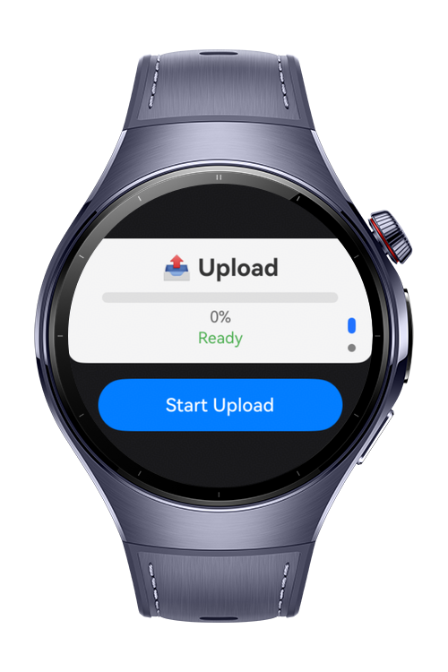
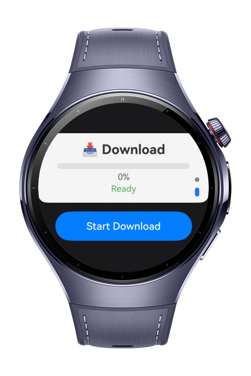

> **Note:** To access all shared projects, get information about environment setup, and view other guides, please visit [Explore-In-HMOS-Wearable Index](https://github.com/Explore-In-HMOS-Wearable/hmos-index).

# How To Track HTTP Request Progress

This codelab shows how to track http request progress using `@kit.NetworkKit` on HarmonyOS.

# Preview
<div>
    
    
    
    
</div>

# Use Cases
- Download and upload file
- track progress

# Tech Stack
- **Languages**: ArkTS, ArkUI
- **Frameworks**: HarmonyOS SDK 6.1.1(24)
- **Tools**: DevEco Studio 6.1.1.300
- **Libraries**: 
    - @kit.ArkUI
    - @kit.NetworkKit

# Directory Structure
```
entry/src/main/ets/
├── common
│    └── HttpService.ets
├── components
│    └── ProgressDisplay.ets
├── entryability
│    └── EntryAbility.ets
├── entrybackupability
│    └── EntryBackupAbility.ets
└── pages
     └── Index.ets
```

# Constraints and Restrictions
## Supported Device
- HarmonyOS devices (e.g. Huawei Watch 5, compatible emulators)

# License
**How To Track HTTP Request Progress** is distributed under the terms of the MIT License.  
See the [LICENSE](LICENSE) file for more information.